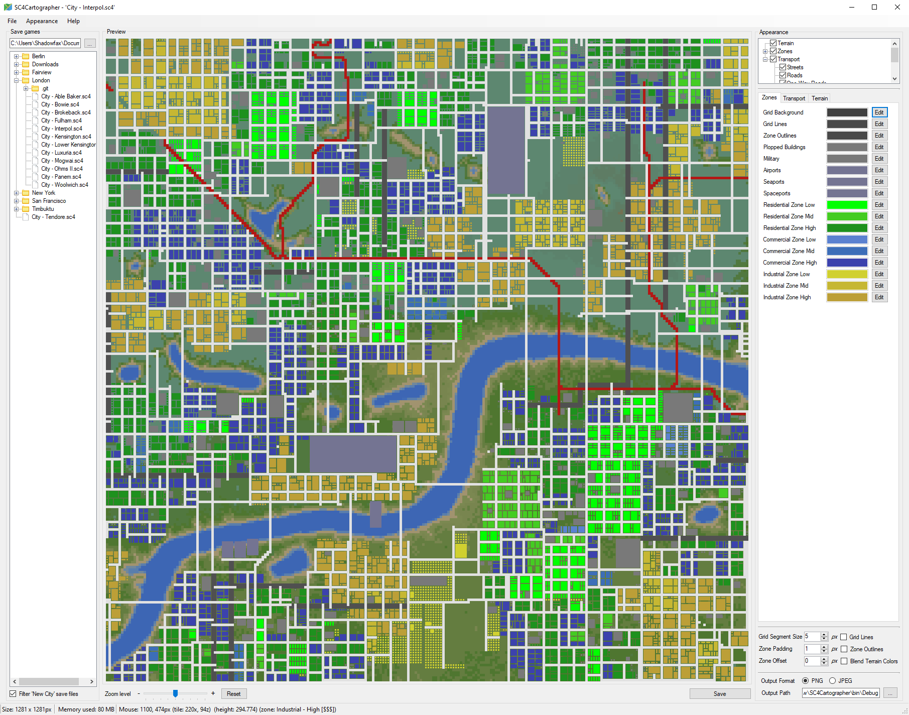
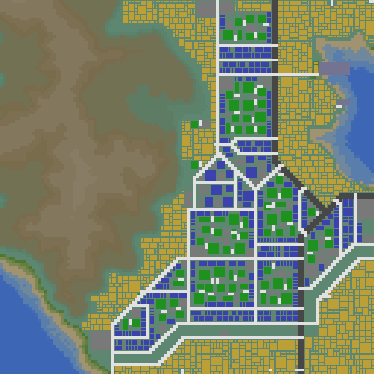

# SC4Cartographer
[](https://github.com/Killeroo/SC4Cartographer/releases) 

Generate maps for your SimCity4 cities!



Maps are created using a city's terrain, zone and transport data. All colours and aspects of the map are fully customisable.

# Downloads
The latest stable release can be downloaded [here](https://github.com/Killeroo/SC4Cartographer/releases/latest)

# Example Maps

Here are some map images that have been created using SC4Cartographer





# Building & Developing

First thing you want to do is make sure you have .NET Framework installed (you probably will), then you will need to pull down the repository and it's submodules:
```
git clone --recurse-submodules https://github.com/Killeroo/SC4Cartographer.git
```
Now if you open up SC4Cartographer.sln in Visual Studio 2017 community or higher you are good to go!

If you want to modify any of the [UI code](https://github.com/Killeroo/SC4Cartographer/blob/716bedd7d1c1ac253b502ddce1208dee76670605/SC4Cartographer/MainForm.cs#L22) or [map generation](https://github.com/Killeroo/SC4Cartographer/blob/716bedd7d1c1ac253b502ddce1208dee76670605/SC4Cartographer/MapRenderer.cs#L17) code you can find it in the SC4Cartographer project (it will be a bit messy).

SC4Cartographer uses another library I made called SC4Parser for parsing and loading data from SimCity 4 savegames, so if you want to use or modify any of that functionality you can find it [here](https://github.com/Killeroo/SC4Parser).

# Thanks

* Special Thanks to [XCity](https://community.simtropolis.com/profile/792216-xcity/) for helping test and who's cities a lot of the example maps were created from.
* [SC4 Encyclopedia](https://wiki.sc4devotion.com/index.php?title=Main_Page), without the excellent documentation on this site none of this would be possible.

# License

```
MIT License

Copyright (c) 2021 Matthew Carney

Permission is hereby granted, free of charge, to any person obtaining a copy
of this software and associated documentation files (the "Software"), to deal
in the Software without restriction, including without limitation the rights
to use, copy, modify, merge, publish, distribute, sublicense, and/or sell
copies of the Software, and to permit persons to whom the Software is
furnished to do so, subject to the following conditions:

The above copyright notice and this permission notice shall be included in all
copies or substantial portions of the Software.

THE SOFTWARE IS PROVIDED "AS IS", WITHOUT WARRANTY OF ANY KIND, EXPRESS OR
IMPLIED, INCLUDING BUT NOT LIMITED TO THE WARRANTIES OF MERCHANTABILITY,
FITNESS FOR A PARTICULAR PURPOSE AND NONINFRINGEMENT. IN NO EVENT SHALL THE
AUTHORS OR COPYRIGHT HOLDERS BE LIABLE FOR ANY CLAIM, DAMAGES OR OTHER
LIABILITY, WHETHER IN AN ACTION OF CONTRACT, TORT OR OTHERWISE, ARISING FROM,
OUT OF OR IN CONNECTION WITH THE SOFTWARE OR THE USE OR OTHER DEALINGS IN THE
SOFTWARE.
```
